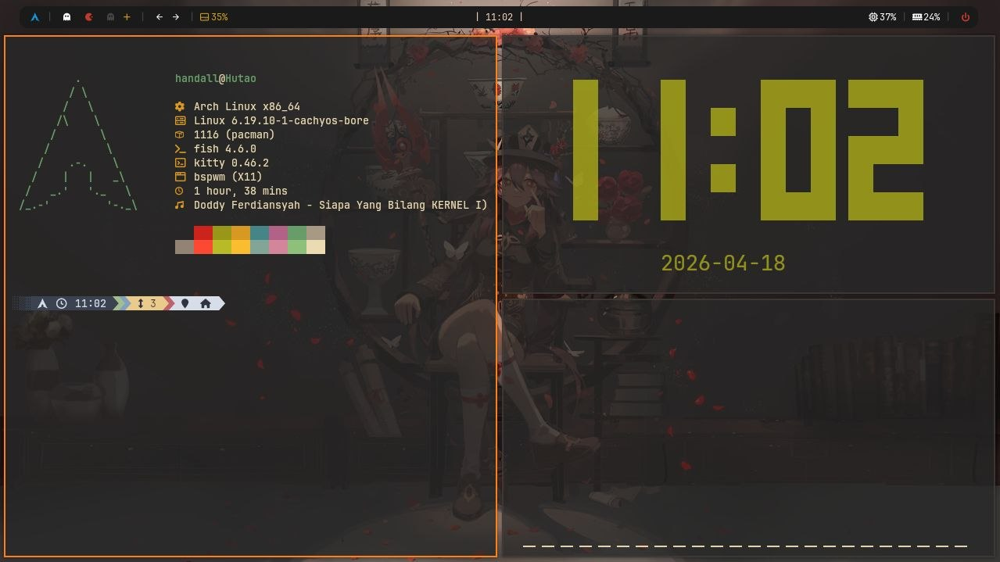

# Hutao Dotfiles

<p align="center">
  
</p>

Dotfiles BSPWM pribadi (ricing) untuk Arch Linux.

- Target desain: **1280x720 (720p)**
- WM: **bspwm** + **sxhkd**
- Bar: **polybar** (default: `hutao-main`)
- Launcher: **rofi**
- Terminal: **kitty**
- Compositor: **picom (ft-labs)**
- Notification: **dunst**
- Shell: **fish**
- Editor: **neovim**

> Catatan: repo ini adalah hasil salinan dari config aktif. Tidak membuat tema/config baru.

---

## Preview / Notes

- Polybar launch default:
  - `~/.config/polybar/launch.sh --hutao`
- Konfigurasi ini dibuat untuk 720p, jadi padding/ukuran bar/font akan terasa paling pas di resolusi itu.

---

## Struktur Repo

```
.
├── config/        # isi ~/.config/ (bspwm, sxhkd, polybar, rofi, kitty, picom, dunst, fish, nvim)
├── scripts/       # isi ~/.local/bin/ (yang portable)
├── fonts/         # isi ~/.local/share/fonts/
├── wallpapers/    # wallpaper (akan masuk ke ~/Pictures/Wallpapers)
├── packages.txt   # dependency (official + AUR)
└── install.sh     # installer otomatis (pacman + yay)
```

---

## Dependency

Semua dependency ada di `packages.txt` dan otomatis di-install oleh `install.sh`.

- **Official repo (pacman)**: `pacman -S --needed`
- **AUR (yay)**: `yay -S --needed` (script akan install yay jika belum ada)

Catatan: compositor yang dipakai adalah **picom-ftlabs-git (AUR)**.

---

## Cara Install (Recommended)

> Saran: backup dulu config lama kamu, karena install akan menimpa/merge isi folder target.

1) Clone repo:

```bash
git clone https://github.com/hndll56/hutao-dotfiles.git
cd hutao-dotfiles
```

2) Jalankan installer:

```bash
chmod +x install.sh
./install.sh
```

Hasil restore:
- `config/*`  → `~/.config/`
- `scripts/*` → `~/.local/bin/`
- `fonts/*`   → `~/.local/share/fonts/`
- `wallpapers/*` → `~/Pictures/Wallpapers/`

Script juga akan menjalankan:
- `fc-cache -fv`

---

## Setelah Install

- Reload bspwm / sxhkd sesuai kebiasaan kamu.
- Kalau polybar belum muncul:

```bash
~/.config/polybar/launch.sh --hutao
```

---

## Catatan Penting (Portable / Hardcoded)

Beberapa hal memang bergantung environment (ini sesuai config asli):

1) **Network interface**
   - Polybar theme `hack` memakai interface `ens33` (lihat `config/polybar/hack/modules.ini`).
   - Kalau interface kamu beda (misal `wlan0`, `enpXsY`), ganti manual di file itu.

2) **pywal (opsional / legacy)**
   - Di `bspwmrc` ada pemanggilan: `$HOME/.cache/wal/colors.sh`
   - Kalau kamu memang nggak pakai pywal, ini bisa diabaikan. Kalau file itu tidak ada, biasanya cuma muncul error kecil di stderr tapi session tetap lanjut.
   - Kalau mau benar-benar bersih, kamu bisa comment/hapus bagian itu di `bspwmrc` (sesuai kebutuhan kamu).

3) **AudioRelay (opsional / device-specific)**
   - `bspwmrc` menjalankan: `$HOME/portable/bin/AudioRelay &`
   - Ini biasanya cuma relevan di device yang memang punya binary AudioRelay di path tersebut.
   - Di device lain, install tetap jalan; paling AudioRelay tidak akan start (abaikan saja atau sesuaikan di `bspwmrc`).

---

## Troubleshooting

- `git push` minta password:
  - GitHub sudah tidak pakai password login untuk git HTTPS.
  - Pakai Personal Access Token (PAT) sebagai password.

- Fonts tidak kebaca:

```bash
fc-cache -fv
```

- Polybar crash / module error:
  - Cek module hardware path (network/battery/temperature) sesuai device.

---

## Lisensi

Personal dotfiles. Pakai, modif, dan fork sesukamu.
