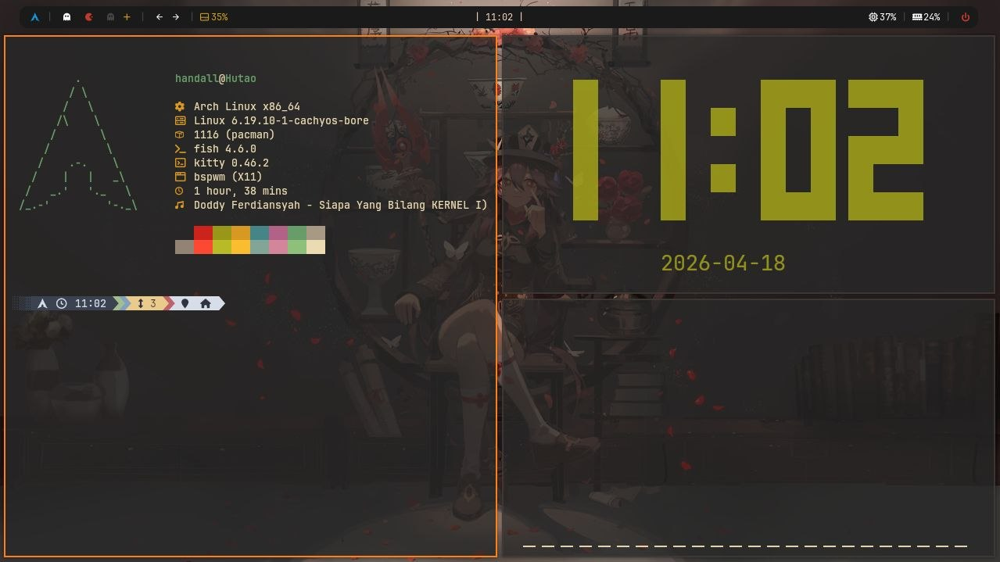

# HUTAO DOTFILES
## bspwm rice for Arch Linux (720p setup)

<p align="center">
  
</p>

Personal Arch Linux dotfiles for a lightweight, anime-inspired BSPWM desktop. This repository is a snapshot of an active configuration rather than a universal theme, so some hardware- and user-specific values may need adjustment.

## Features

- **Window manager:** bspwm
- **Hotkeys:** sxhkd
- **Status bar:** polybar (`hutao-main` by default)
- **Launcher:** rofi
- **Terminal:** kitty
- **Compositor:** picom-ftlabs-git
- **Notifications:** dunst
- **Shell:** fish
- **Editor:** Neovim
- **Target resolution:** 1280×720 (720p)

> The layout, spacing, font sizes, and bar dimensions are tuned for 720p. Other resolutions may require manual adjustments.

## Preview and Screenshots

The main preview is available at [`assets/preview.jpg`](assets/preview.jpg). Add more screenshots or GIFs to `assets/` if you want to document alternate layouts.

## Repository Structure

```text
.
├── config/        # Files restored into ~/.config/
├── scripts/       # Portable user scripts restored into ~/.local/bin/
├── fonts/         # Fonts restored into ~/.local/share/fonts/
├── wallpapers/    # Wallpapers copied into ~/Pictures/Wallpapers/
├── packages.txt   # Official repository and AUR dependencies
├── install.sh     # Installation and restore script
└── README.md      # Project documentation
```

## How the Configuration Works

The desktop session is built from several independent programs:

```text
bspwm
├── sxhkd   → keyboard shortcuts and commands
├── polybar → workspaces, system information, and controls
├── rofi    → application launcher
├── kitty   → terminal
├── picom   → transparency and compositing
└── dunst   → desktop notifications
```

The files in `config/` mirror the usual locations under `~/.config/`. The installer copies these files to their runtime locations, while scripts, fonts, and wallpapers are copied to their respective directories.

## Requirements

- Arch Linux or an Arch-based distribution
- A working X11 session
- Git
- `pacman`
- `yay` for AUR packages (the installer can install it when needed)
- A BSPWM-compatible login/session setup

Wayland is not the target environment for this configuration because it uses X11-oriented components such as BSPWM and sxhkd.

## Installation

> Back up existing configuration files before installing. The script may overwrite or merge files in the target directories.

```bash
git clone https://github.com/hndll56/hutao-dotfiles.git
cd hutao-dotfiles
chmod +x install.sh
./install.sh
```

The installer restores:

- `config/*` → `~/.config/`
- `scripts/*` → `~/.local/bin/`
- `fonts/*` → `~/.local/share/fonts/`
- `wallpapers/*` → `~/Pictures/Wallpapers/`

It also refreshes the font cache with `fc-cache -fv`.

## First Run

After installation, start or reload BSPWM and sxhkd according to your session setup. If Polybar does not start automatically, run:

```bash
~/.config/polybar/launch.sh --hutao
```

If a shortcut does not work, check `~/.config/sxhkd/sxhkdrc`. If a bar module fails, inspect the relevant Polybar module configuration and adapt it to your hardware.

## Customization Guide

### Change the wallpaper

Replace or add images in `wallpapers/`, then update the wallpaper command in the BSPWM configuration if necessary.

### Change Polybar

The default launch command is:

```bash
~/.config/polybar/launch.sh --hutao
```

To change colors, fonts, spacing, or modules, inspect the relevant files under `config/polybar/`. Different themes may have different module files.

### Change keyboard shortcuts

Edit:

```text
config/sxhkd/sxhkdrc
```

The file is copied to `~/.config/sxhkd/sxhkdrc`. After editing, reload sxhkd or restart the session.

### Change BSPWM behavior

Edit the BSPWM configuration under:

```text
config/bspwm/
```

Common changes include border width, gaps, rules, desktops, and startup applications.

### Add scripts

Place executable scripts in `scripts/`. They will be installed into `~/.local/bin/`. Prefer portable paths and document required commands at the top of each script.

## Portability Notes

Some values are intentionally inherited from the original machine and may need editing:

1. **Network interface** — The Polybar `hack` theme uses `ens33` in `config/polybar/hack/modules.ini`. Replace it with your interface, such as `wlan0` or `enpXsY`.
2. **pywal** — `bspwmrc` references `$HOME/.cache/wal/colors.sh`. This is optional legacy behavior. Install pywal or comment out the reference if it is not used.
3. **AudioRelay** — `bspwmrc` starts `$HOME/portable/bin/AudioRelay` when present. Remove or change this line if AudioRelay is not installed.
4. **Hardware modules** — Battery, temperature, audio, and network modules may use device-specific names or paths.
5. **Fonts** — If the appearance differs, verify that the fonts in `fonts/` are installed and run `fc-cache -fv`.

## Troubleshooting

### Polybar does not appear

```bash
~/.config/polybar/launch.sh --hutao
```

Then check the terminal output for missing modules or invalid hardware names.

### Fonts are missing

```bash
fc-cache -fv
```

Restart applications after refreshing the font cache.

### A module reports an error

Open the corresponding file under `config/polybar/` and check interface names, battery paths, temperature sensors, and required commands.

### Permission denied for a script

```bash
chmod +x ~/.local/bin/<script-name>
```

## Contributing

Fork the repository, create a branch for your change, test it on your own setup, and open a Pull Request. Keep changes focused and document hardware-specific assumptions. See [`CONTRIBUTING.md`](CONTRIBUTING.md) for the complete workflow.

## Credits

This configuration uses and is built around the following projects:

- [bspwm](https://github.com/baskerville/bspwm) — Tiling window manager.
- [sxhkd](https://github.com/baskerville/sxhkd) — Simple X hotkey daemon.
- [polybar](https://github.com/polybar/polybar) — Status bar.
- [rofi](https://github.com/davatorium/rofi) — Application launcher.
- [kitty](https://github.com/kovidgoyal/kitty) — Terminal emulator.
- [picom](https://github.com/yshui/picom) — X11 compositor.
- [dunst](https://github.com/dunst-project/dunst) — Notification daemon.
- [fish](https://github.com/fish-shell/fish-shell) — Interactive shell.
- [Neovim](https://github.com/neovim/neovim) — Editor.

Thanks to the maintainers and contributors of these open-source projects.

## License

Personal dotfiles. You are free to use, modify, and fork this repository. Individual dependencies remain under their respective licenses.
